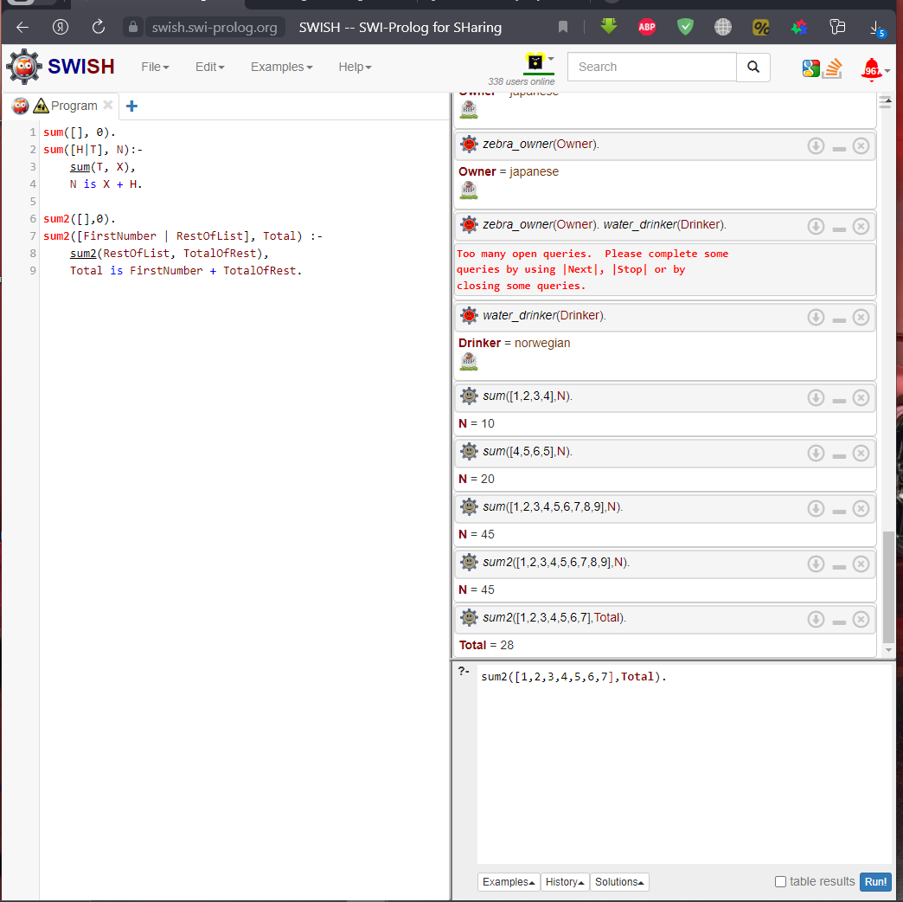

### Сумма элементов списка

- #### Контекст

Мы уже видели множество решений этой задачи в различных
стилях. Пришло время решить её с помощью логической
парадигмы.

- #### Задача

Написать программу на языке Prolog для вычисления суммы
элементов списка. На вход подаётся целочисленный массив.
На выходе - сумма элементов массива.

- #### Решение

 
Во-первых, сумма пустого списка равна 0 - это добавление факта .

Во-вторых, сумма N элемента H и списка T является суммой списка, T добавленного к H. Пролог работает на унификации, поэтому здесь говорится, что N унифицировано с суммой H и T, где сумма T унифицирована с X использованием sum(T,X).

Ниже представлено второе решение данного метода, с более подробным и понятным описанием, которое работвет по той же логике что и первое.

Оба решения протестированы, результат их вывода показан на скриншоте справа внизу.

